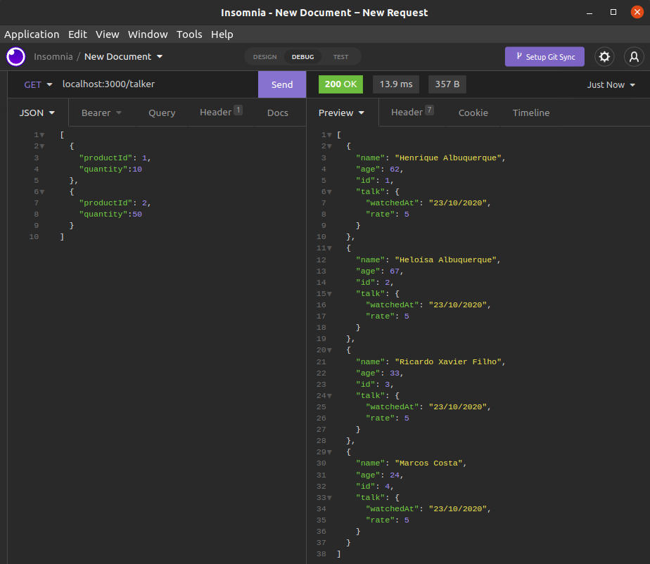

# Projeto Talker Manager

Este foi o primeiro projeto o qual utilizamos o Express para criar APIs. Por hora, ainda sem conectar com o banco de dados para salvar as informações. Por isso, existe o arquivo `talker.json`, com o intuito de simular o Banco de Dados.

Foram criados alguns MiddleWares de validação para tratar requisições inválidas. Eles podem ser encontrados no arquivo `validation.js`.

---

# Habilidades

- Desenvolver uma API com o NodeJs utilizando o Express;

- Criar MiddleWares de validação de dados para as requisições;

- Criar endpoints que recebem informações no corpo de requisição;

- Criar endpoints que recebem informações nos parâmetros e queries do endpoint;

- Utilizar um software (neste caso, o Insomnia) para realizar as requisições.

---

## Requisitos

Ao todo foram 8 requisitos, sendo eles:
  
#### 1. Crie o endpoint GET `/talker`;
#### 2. Crie o endpoint GET `/talker/:id`;
#### 3. Crie o endpoint POST `/login`;
#### 4. Adicione as validações para o endpoint `/login`;
#### 5. Crie o endpoint POST `/talker`;
#### 6. Crie o endpoint PUT `/talker/:id`;
#### 7. Crie o endpoint DELETE `/talker/:id`;
#### 8. Crie o endpoint GET `/talker/search?q=searchTerm`.